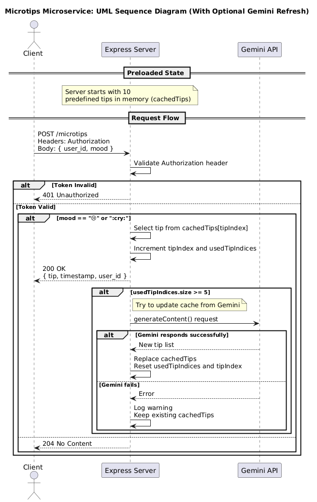

# Mood Tip Microservice

This microservice responds with short positive tips based on user mood, using Gemini API or fallback defaults.

## 📌 Overview

- Language: Node.js
- Framework: Express.js
- Endpoint: /microtips
- Method: POST
- Auth: Bearer token via Authorization header
- Purpose: To return encouraging tips to a client application when a user is feeling sad ("😢")

## 🔐 Authentication

This microservice requires a valid token passed in the Authorization header:

Authorization: Bearer <MICROTIPS_TOKEN>

The expected token is stored in your `.env` file as:

`MICROTIPS_TOKEN=your_secure_token_here`

## 📬 How to REQUEST Data

Make a POST request to the /microtips endpoint with the following JSON body:

```js
{
"user_id": "abc123",
"mood": "😢"
}
```

Example curl call:

```bash
curl -X POST http://api.callumpickard.com/microtips \
 -H "Content-Type: application/json" \
 -H "Authorization: Bearer MICROTIPS_TOKEN" \
 -d '{"user_id": "abc123", "mood": "😢"}'
```

Example JavaScript call:

```js
import dotenv from "dotenv";

dotenv.config();
const bearerToken = process.env.MICROTIPS_TOKEN;

fetch("http://api.callumpickard.com/microtips", {
  method: "POST",
  headers: {
    "Content-Type": "application/json",
    Authorization: `Bearer ${bearerToken}`,
  },
  body: JSON.stringify({
    user_id: "12345",
    mood: "😢",
  }),
})
  .then((res) => res.json())
  .then((data) => console.log(data))
  .catch((err) => console.error(err));
```

## 📥 How to RECEIVE Data

If mood is "😢", the response will contain a positive tip:

```js
{
"user_id": "abc123",
"timestamp": "2025-05-19T23:32:00.123Z",
"tip": "Take a 10-minute walk and notice five things you see."
}
```

## 📡 API Responses

The microservice may return the following HTTP status codes:

| Status Code               | Meaning                  | Description                                                                                     |
| ------------------------- | ------------------------ | ----------------------------------------------------------------------------------------------- |
| 200 OK                    | Success                  | A tip is returned in the JSON response body when mood is "😢".                                  |
| 204 No Content            | No tip needed            | The mood provided did not trigger a tip response (e.g., mood is not "😢").                      |
| 400 Bad Request           | Invalid request body     | The request body is missing required fields like `user_id` or `mood`.                           |
| 401 Unauthorized          | Invalid or missing token | The `Authorization` header was missing or did not match the expected value.                     |
| 500 Internal Server Error | Server error             | Unexpected failure occurred while processing the request. Fallback tips will be used if needed. |

## 📈 UML Sequence Diagram



## 🧪 Test

Use the provided curl example above or a simple test script to demonstrate that the endpoint works and returns a response. Ensure your .env file contains the proper API token and Gemini key.

## 🧯 Integration Mitigation Plan

Currently the service is running on a dedicated Linux server (RaspberryPi in my home) and is running a CloudFare tunnel, and is using my personal domain (callumpickard.com). To improve security, this service is using a bearer token.

- Teammate using this: **Ricardo Porras**
- Bearer Token has been shared via private channel
- Current status: Microservice is complete and working ✅

### Access instructions:

- Make a POST request to: https://api.callumpickard.com/microtips

  - Include an Authorization header and with `Bearer token`

  - Include a Content-Type header with `application/json`

  - Ensure JSON contains user_id field - `string`

  - Ensure JSON contains mood field - `UTF-8 encoded emoji`

### If the microservice does not respond:

- Check your HTTPS response for errors

  - Verify the Bearer Token did not fail (401 Response Status)

- Notify me by 05/21/2025 23:59 should the service not function accordingly.

- Contact me via discord / canvas / OSU email

### GitHub Repo

https://github.com/EpicurianCoder/microtips

Alternatively Ricardo has been provided access to the Repository and can clone it and run it locally.

The only major change being that the endpoint would become `localhost:3000/microtips` when running the server locally

This can be cloned and successfully run locally **WITH** and **WITHOUT** the Gemini API key.

- **With** the use of an .env file containing the Gemini API key:

  - Each time half of the list has been used, a call to the Gemini API will refresh the list of responses, ensuring no repetition.

- **Without** the use of an .env file containing the Gemini API key:

  - This will fall back on the hardcoded responses when the call to the Gemini API fails.

Alternatively, another GEMINI API key can be added to the .env file and the calls to the gemini should execute successfully, provided the API key has been set up and enabled.

## 📎 Assumptions & Notes

- This microservice currently only responds to the 😢 mood. Future support for other moods can be added easily.
- Responses are randomized but ensure no immediate repetitions.
- Uses fallback tips if Gemini API fails.
